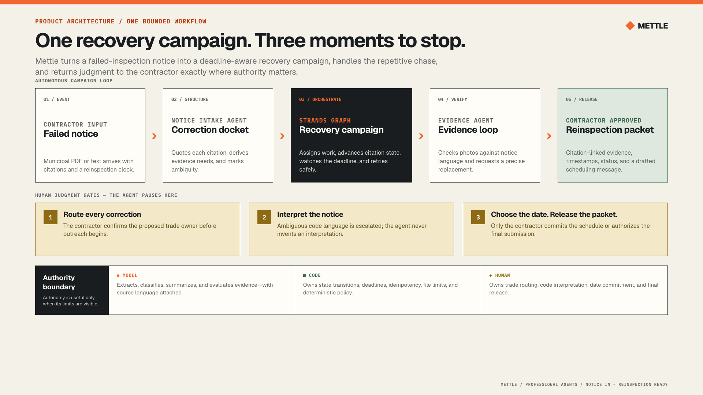
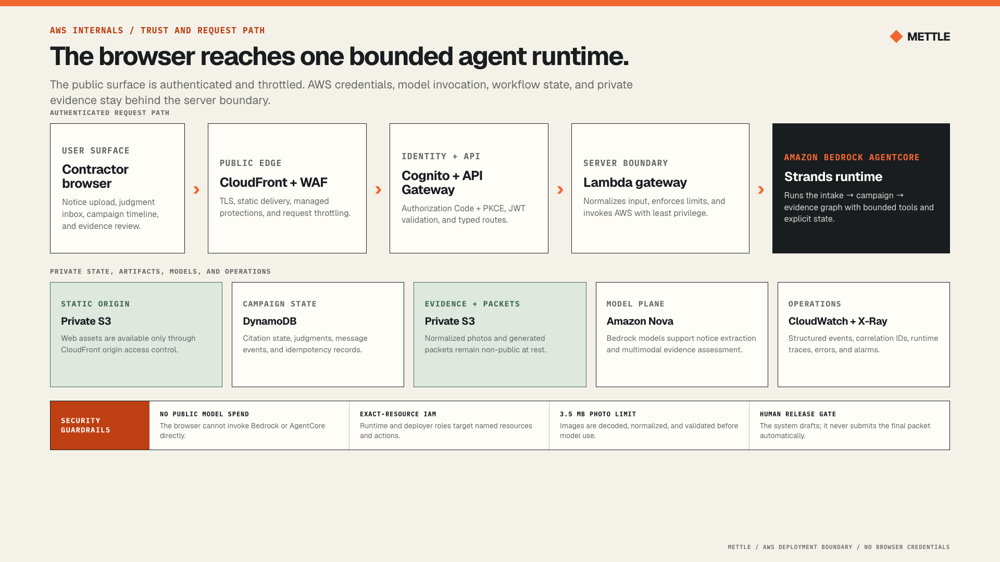

<p align="center">
  
</p>

<h1 align="center">Mettle</h1>

<p align="center"><strong>From failed inspection to reinspection-ready.</strong></p>

<p align="center">
  <a href="https://d1ytth8asjpes8.cloudfront.net">Live guided demo</a> ·
  <a href="assets/architecture/mettle-product-architecture.png">Product architecture</a> ·
  <a href="assets/architecture/mettle-aws-architecture.png">AWS architecture</a> ·
  <a href="LICENSE">MIT license</a>
</p>

**Agents for Humans Hackathon · Professional Agents track**

Mettle is a bounded-autonomy recovery agent for small residential contractors. It turns a municipal failed-inspection notice into a citation-by-citation campaign, follows the reinspection clock, reviews visible evidence, and assembles an approved recovery packet—while reserving code interpretation and irreversible decisions for the licensed contractor.

> **The person and the repetitive work:** Small contractors are stuck repeatedly translating failed-inspection notices into assignments, chasing trades for proof, watching the reinspection deadline, and rebuilding the same evidence trail by hand.

## One workflow, end to end

Mettle starts with the event contractors already receive: a failed-inspection notice. It does not require them to configure a new project, author evidence rules, or maintain another punch list first.

1. **Understand the notice.** A Strands intake agent converts unstructured municipal language into a validated correction docket while preserving the source text.
2. **Pause before outreach.** The contractor confirms the responsible trade, closure route, and proof request for every citation. Until then, Mettle records zero outreach.
3. **Run the recovery.** A Strands graph assigns open corrections, records replay-safe follow-ups, and changes urgency at server-selected T−7, T−3, T−2, T−1, and deadline checkpoints. EventBridge Scheduler wakes the authenticated workflow for the next bounded check; the contractor does not have to keep the dashboard open.
4. **Review visible proof.** A dedicated multimodal Strands Evidence Agent uses Nova Lite to check only whether a submitted photo shows the notice-specific requirements. Insufficient photos receive a precise re-request; ambiguity returns to the contractor.
5. **Close with consent.** Mettle maps each citation to its evidence and communication history, then blocks the final PDF until the contractor approves it.

The result is not another dashboard to babysit. Mettle works between events and surfaces when professional judgment is actually required.

## See it work

Open the **[live guided demo](https://d1ytth8asjpes8.cloudfront.net)** and select **Take the 90-second tour**. The public journey stages the real sample endpoints into five focused scenes, using synthetic contractor, property, notice, and evidence data so judges can experience the complete product without credentials or cloud spend. Every result remains inspectable afterward in the full workspace.

The compressed run demonstrates:

- a raw failed-inspection notice becoming three grounded corrections;
- accepted evidence and an inadequate photo receiving a specific re-request;
- deadline-aware escalation for an unresolved trade;
- meaningful human pauses rather than constant supervision; and
- a contractor-approved, citation-to-evidence PDF packet.

The **Agent run** panel makes the orchestration inspectable: judges can see specialist handoffs, graph-node execution, evidence-agent work, and exactly where Mettle paused for professional judgment. Sample playback is labeled `SAMPLE TRACE`; real workflow runs are labeled `LIVE · STRANDS` or `LIVE · AGENTCORE`.

The browser playback is clearly labeled as a guided demonstration. The repository also includes the working Strands workflow, opt-in Bedrock execution, and deployed AgentCore boundary used by the live cloud path.

The unauthenticated Strands route keeps workflow state in one warm Lambda instance, so shared `?workflow=` links are demonstration conveniences rather than durable records. The deployed authenticated AgentCore path owns session mapping in DynamoDB and creates one-time EventBridge schedules with stale-event rejection, retries, and a dead-letter queue. The 90-second judge run is deliberately accelerated and remains bounded by AgentCore's eight-hour session lifetime; multi-day production campaign persistence is future work.

## Architecture

### Product architecture: autonomy with visible stopping points



This view explains the product contract: Mettle runs one correction-recovery campaign, but it stops for trade routing, ambiguous notice interpretation, and final schedule or packet approval.

### AWS architecture: one authenticated path to a bounded runtime



This view explains the deployment boundary: the browser passes through CloudFront, WAF, Cognito, API Gateway, and a Lambda gateway before reaching the Strands workflow on Amazon Bedrock AgentCore. Model access, state, and evidence remain server-side.

Both submission-ready PNGs are 1920×1080. The editable Pencil source is [`untitled.pen`](untitled.pen); deterministic HTML render sources live beside the PNGs, and the deeper design rationale lives in [`docs/architecture.md`](docs/architecture.md).

## Why this is genuinely agentic

Mettle is event-driven work across time, not a prompt-response wrapper. It keeps explicit campaign state around Strands recovery graphs, invokes bounded operations, pauses through native interrupts, and resumes the same workflow after a contractor decision.

| Capability | Implementation | Source |
| --- | --- | --- |
| Notice understanding | A real `strands.Agent` using a bounded Nova Micro model and validated structured output | [`src/mettle/agents/intake.py`](src/mettle/agents/intake.py) |
| Campaign orchestration | Two Strands `GraphBuilder` graphs: intake-to-coordination and deadline chase | [`src/mettle/workflow.py`](src/mettle/workflow.py) |
| Human judgment | Strands hooks interrupt before outreach, at ambiguous requirements, and at the deadline tradeoff | [`src/mettle/workflow.py`](src/mettle/workflow.py) |
| Visible-evidence assessment | A dedicated multimodal `strands.Agent` on Nova Lite, followed by deterministic accept, re-request, or manual-review policy | [`src/mettle/agents/vision.py`](src/mettle/agents/vision.py) |
| Inspectable autonomy | Safe Strands graph hooks and evidence-agent traces rendered as a visible Agent Run without exposing prompts or private payloads | [`src/mettle/workflow.py`](src/mettle/workflow.py), [`src/mettle/web/static/app.js`](src/mettle/web/static/app.js) |
| Managed agent runtime | The same typed workflow operations run behind an Amazon Bedrock AgentCore entrypoint | [`agentcore_app.py`](agentcore_app.py) |
| Work across time | One-time EventBridge schedules wake the next deadline checkpoint; schedule versions and idempotency keys make stale or replayed events safe | [`src/mettle/automation.py`](src/mettle/automation.py), [`src/mettle/scheduler_runtime.py`](src/mettle/scheduler_runtime.py) |
| One-way trade updates | Communication records by default; opt-in Amazon SNS delivery is restricted to one pre-approved, hashed demo destination and never accepts inbound messages | [`src/mettle/communication.py`](src/mettle/communication.py) |
| Secure public product | CloudFront, private S3, Cognito PKCE, API Gateway, Lambda, DynamoDB, WAF, and short-lived packet delivery | [`infra/web/template.yaml`](infra/web/template.yaml) |

This division is deliberate. Language models are useful where inputs are unstructured or visual; deterministic policy is safer where a deadline, retry, permission, or compliance claim must be exact.

## Bounded autonomy

| Mettle handles autonomously | The contractor decides | Mettle never does |
| --- | --- | --- |
| Extract and quote correction language | Confirm correction routing before outreach | Certify that work complies with code |
| Track open citations against the deadline | Interpret an ambiguous citation | Invent missing municipal requirements |
| Re-plan only unresolved work | Keep the date or reschedule at T−2 | Contact an inspector without approval |
| Re-request insufficient visible evidence | Resolve evidence that is not visually decidable | Expose AWS credentials to the browser |
| Assemble the evidence trail | Approve the final packet | Release the packet without consent |

The authority boundary is the product: autonomy absorbs coordination, while accountability stays with the professional.

## Run locally—no AWS account required

Use Python 3.12 and [`uv`](https://docs.astral.sh/uv/):

```bash
uv sync --extra dev
uv run mettle ingest examples/notices/failed-rough-in.txt --as-of 2026-08-10
uv run mettle serve
```

Open [http://127.0.0.1:4310](http://127.0.0.1:4310), then select **Take the 90-second tour**, **Explore the sample freely**, or **Start a recovery**. The server binds only to the local machine. The included communication adapter records proposed messages but sends nothing externally.

The default path is deterministic, reproducible, and free. It uses the same domain contracts, Strands graphs, interrupts, retry rules, packet gate, and UI as the cloud path without invoking a model.

### Opt in to live Bedrock intake

```bash
uv run mettle serve \
  --enable-bedrock \
  --aws-profile mettle-dev \
  --aws-region us-east-1
```

This exposes **Ground with Bedrock** and enables real-photo assessment. Model ID, region, token ceilings, retry limits, and timeouts remain server-side; the browser cannot override them. A Strands intake agent on Nova Micro handles notice extraction, while a separate Strands Evidence Agent on Nova Lite receives normalized JPEG/PNG evidence and returns pixel-grounded structured findings—not a code-compliance opinion.

### Run through AgentCore

The AgentCore app accepts a small, discriminated operation contract covering `start`, `review`, `resume`, evidence, deadline checks, packet assembly, and final approval.

```bash
npm ci
npx agentcore dev --runtime MettleRecovery --port 8081 --logs --skip-deploy
```

To connect the local command center to the deployed runtime:

```bash
uv run mettle serve \
  --enable-agentcore \
  --agentcore-runtime-arn "$METTLE_AGENTCORE_RUNTIME_ARN" \
  --aws-profile mettle-agentcore \
  --aws-region us-east-1
```

The gateway owns the AgentCore session identifier, reuses it for safe retries and resume, and never exposes the runtime ARN or AWS credentials to the browser. See [`docs/agentcore-deployment.md`](docs/agentcore-deployment.md) for packaging, deployment, smoke testing, and rollback.

## Test the working implementation

```bash
uv run pytest
npm ci
npx agentcore validate --json
```

The 119-test suite exercises notice parsing, campaign policy, Strands node tracing, interruptions and resume, failed-review retry safety, multimodal evidence-agent contracts, evidence decisions, upload normalization, replay protection, packet gating, AgentCore contracts, schedule creation and stale-event rejection, one-way delivery guardrails, the durable gateway, web routes, and infrastructure assertions. It runs without AWS credentials or model spend.

[`scripts/web_scheduler_smoke.py`](scripts/web_scheduler_smoke.py) provides the paid deployment acceptance path. It creates a synthetic authenticated workflow, confirms schedule version 1 exists, waits for the private worker to advance the workflow and arm version 2, then cancels the follow-on smoke schedule. The final deployment acceptance passed with an empty DLQ and no SMS permission or send.

## Security and cost boundaries

- **No public cloud spending path:** the guided demo is deterministic; credit-metered routes require an admin-created Cognito account.
- **No credentials in the client:** all AWS profiles, regions, model IDs, runtime identifiers, and session IDs remain server-side.
- **Least privilege:** checked-in IAM policies restrict model access to Nova Micro and Nova Lite and runtime invocation to Mettle's resource.
- **Replay safety:** workflow creation, follow-ups, evidence submission, and resume operations use idempotency controls.
- **Bounded scheduling:** each checkpoint is a one-time EventBridge schedule with a versioned payload, two retries, a dead-letter queue, and automatic deletion; stale events cannot advance the workflow.
- **No open messaging channel:** SMS is outbound-only and disabled by default. Enabling Amazon SNS requires a server-side SHA-256 allowlist for one demo phone; all other recipients remain recorded simulations.
- **Safe uploads:** image bodies are capped, decoded, stripped of metadata, dimension-bounded, and re-encoded before model use.
- **Short-lived artifacts:** approved PDFs are integrity-checked, encrypted in private S3, and delivered through a 60-second presigned URL; stored packets expire after one day.
- **Explicit limitations:** AgentCore session state is not presented as durable memory. The accelerated scheduler demonstrates autonomous wake-ups inside one live session, not durable multi-day production operation.

For the full permission model and teardown procedure, see [`docs/aws-access.md`](docs/aws-access.md).

## Repository map

```text
src/mettle/agents/       Strands intake and Bedrock model adapters
src/mettle/workflow.py   Strands graphs, hooks, interrupts, and resume
src/mettle/campaign.py   Deterministic deadline and recovery policy
src/mettle/automation.py One-time EventBridge scheduling and stale-event policy
src/mettle/evidence.py   Evidence contracts and decision boundary
src/mettle/packet.py     Approval-gated PDF generation
src/mettle/web/          Contractor command center and local API
agentcore_app.py         Amazon Bedrock AgentCore entrypoint
infra/web/template.yaml  Secure public AWS stack
examples/                Representative synthetic notice
tests/                   Offline and boundary-focused test suite
assets/submission/       Devpost-ready product screenshots
docs/                    Architecture, scope, research, and operations
```

## Scope

Mettle begins after an inspection fails. It is not a permitting suite, a construction management platform, or an authority on building code. The current hackathon slice handles one project, one representative notice shape, three trades, outbound-only communication, and a compressed deadline clock. Communication records safely by default; an Amazon SNS adapter can deliver only to one pre-approved personal demo number after account enrollment and explicit server-side opt-in.

Those constraints preserve the single workflow that matters: **notice in, recovery out**. Production expansion would add jurisdiction-specific notice adapters, consent and opt-out operations for messaging, and durable campaign persistence without changing the authority boundary.

Read [`docs/product-scope.md`](docs/product-scope.md) and [`docs/contractor-operator-research.md`](docs/contractor-operator-research.md) for the product decisions and domain evidence behind that scope.

## License

Mettle is released under the [MIT License](LICENSE).
