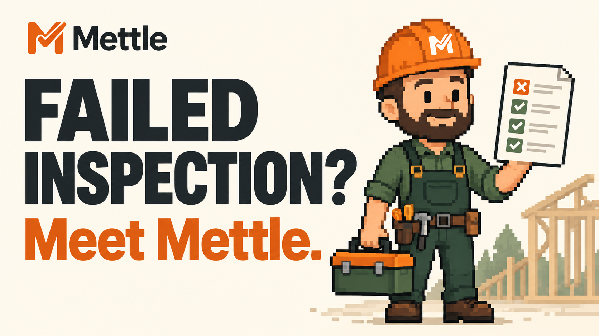
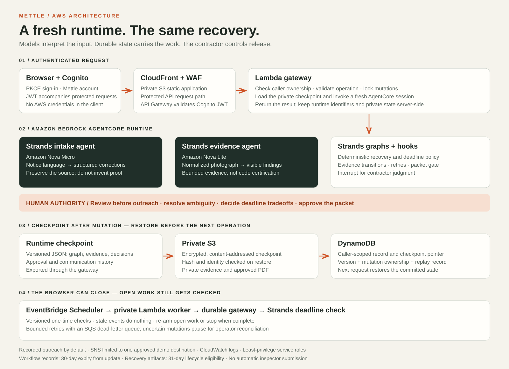

<p align="center"></p>
<h1 align="center">Mettle</h1>
<p align="center"><strong>Less chasing. More building.</strong></p>
<p align="center">
  <a href="https://d1ytth8asjpes8.cloudfront.net/">Try Mettle</a> ·
  <a href="https://youtu.be/ZB3yRfWh8XE">Watch the demo</a> ·
  <a href="#run-locally">Run locally</a> ·
  <a href="#architecture">Architecture</a> ·
  <a href="LICENSE">MIT license</a>
</p>

Mettle helps small residential contractors organize the work after a failed inspection. It turns a correction notice into assignments, follows up on unresolved work, checks submitted photographs against the requested proof, and assembles a reinspection packet for the contractor to approve.

The contractor stays responsible for interpreting requirements and approving the handoff. Mettle handles the coordination around those decisions; it does not certify code compliance.

Built by **Gowtham Sarveswaran** for **Agents for Humans · Professional Agents**.

## Try it

| Start here | What to expect |
| --- | --- |
| **Judge walkthrough** in the [public app](https://d1ytth8asjpes8.cloudfront.net/) | A guided, recorded sample of one recovery. No sign-in or model calls. |
| **Start my recovery** in the app | The authenticated contractor workflow, using deployed Strands agents. An invited Mettle account is required. |
| [Watch the demo](https://youtu.be/ZB3yRfWh8XE) | A 4½-minute walkthrough of the product and its AWS architecture. |

Use a Mettle account, **not an AWS account**, for the signed-in experience. Use redacted notices and photographs without personal information. Sample names, properties, notices, and photographs are synthetic.

The video includes live model operations with synthetic inputs. Outreach is recorded rather than sent to real trades; scheduling a future check is not the same as demonstrating that it has fired.

## From notice to approved packet

1. **Add the notice.** Paste the correction report or upload a PDF with selectable text. Mettle extracts the corrections while preserving the authority’s wording.
2. **Review the plan.** Confirm the responsible trades, closure routes, and proof requests before any outreach. When the notice does not specify enough proof, Mettle asks instead of inventing a requirement.
3. **Let the recovery run.** Open corrections get deadline-aware follow-ups. Background checks resume the recovery without requiring an open browser; a deadline tradeoff returns to the contractor.
4. **Add the proof.** Submit a photograph for a correction. The evidence agent checks what is visible against the approved request. Insufficient evidence gets a specific re-request; ambiguity requires human review.
5. **Approve the handoff.** Review the evidence trail and release the PDF packet. Nothing is submitted to the inspector automatically.

For example, a photograph of an electrical panel may show the equipment but not the clearance requested in the notice. Mettle can request a wider photograph showing that proof. It cannot conclude that a hidden dimension is correct or that the installation passes inspection.

## Run locally

Use Python 3.12 or 3.13 and [uv](https://docs.astral.sh/uv/):

```bash
git clone https://github.com/gowtham0992/Mettle.git
cd Mettle
uv sync --frozen --extra dev
uv run mettle serve
```

Open [http://127.0.0.1:4310](http://127.0.0.1:4310). The default local path uses deterministic fixtures and recorded communication: no AWS account, model calls, or external messages are required.

To inspect a sample notice from the terminal:

```bash
uv run mettle ingest examples/notices/failed-rough-in.txt --as-of 2026-08-10
```

The offline path uses the same domain contracts, Strands graphs, human interrupts, and packet approval rules. It does **not** substitute for testing live model behavior.

For live AWS setup, see [access and permissions](docs/aws-access.md), [AgentCore deployment](docs/agentcore-deployment.md), and the [architecture reference](docs/architecture.md). Model calls and deployed infrastructure can incur AWS charges.

## Architecture

### The product: work continues, authority stays human


The recovery has explicit stopping points: review before outreach, professional judgment when evidence or requirements are ambiguous, and approval before releasing the packet.

### AWS: a fresh runtime restores the same recovery



The browser reaches a protected gateway, not AWS credentials or the agent runtime directly. New authenticated recoveries save private, versioned checkpoints in S3 with caller-scoped records in DynamoDB. Subsequent operations restore that state into a fresh AgentCore runtime. EventBridge Scheduler wakes a private worker for the next deadline check.

See [checkpoint guarantees and limitations](docs/recovery-checkpoints.md) for concurrency, retry, restoration, and retention behavior. [Diagram files](assets/architecture/README.md) identify the current views and older render sources.

## Where the agents do the work

Mettle uses **two model-driven Strands agents**, with deterministic operations around them. It does not present every graph node as another AI agent.

| Responsibility | Implementation |
| --- | --- |
| Understand the notice | [Intake agent](src/mettle/agents/intake.py): Amazon Nova Micro extracts structured corrections from the source language. |
| Assess visible proof | [Evidence agent](src/mettle/agents/vision.py): Amazon Nova Lite returns bounded findings from normalized photographs. |
| Coordinate the recovery | [Strands graphs and hooks](src/mettle/workflow.py): orchestration, human interrupts, and resume. |
| Apply exact rules | [Campaign policy](src/mettle/campaign.py) and [workflow registry](src/mettle/workflow_registry.py): deadline decisions, evidence transitions, and approval gates. |
| Wake background work | [Automation](src/mettle/automation.py) and [scheduler worker](src/mettle/scheduler_runtime.py): versioned, one-time deadline checks. |
| Prepare the handoff | [Packet generation](src/mettle/packet.py): a citation-to-evidence PDF released only after approval. |

The activity view exposes safe execution receipts and human stops, not private reasoning. Recorded sample traces and live runs are labeled separately.

This division is intentional: models handle unstructured language and images; code enforces permissions, retries, dates, and state transitions.

## Safety and operational boundaries

- **Authenticated model access.** The public walkthrough does not invoke models. Credit-metered routes require an invited account; public hosting still has infrastructure costs.
- **Caller-owned recoveries.** The gateway checks ownership and keeps AWS credentials, private checkpoints, and runtime session identifiers server-side.
- **Bounded evidence checks.** Uploads are size-limited, decoded, stripped of metadata, and normalized. Evidence acceptance is not code certification.
- **Recorded communication by default.** Optional outbound Amazon SNS delivery is limited to one pre-approved demo destination. There is no two-way SMS conversation or open recipient list.
- **Replay-aware operations.** Idempotency and schedule versions guard retries and stale events. An uncertain mutation outcome pauses recovery for operator reconciliation rather than risking duplicate outreach.
- **Private packets.** Approved PDFs are delivered through the authenticated gateway. Recovery artifacts become eligible for deletion after 31 days; workflow records expire after 30 days from their last update.
- **Human release.** Mettle never files a packet with an inspector or declares that corrected work complies with building code.

Deployment permissions and teardown instructions are in [AWS access](docs/aws-access.md). Infrastructure is defined in the [public web stack](infra/web/template.yaml).

## Development and tests

After the Python setup above, install the JavaScript development dependencies and run the repository’s verification gate:

```bash
npm ci
npm --prefix agentcore/cdk ci
npm run verify
```

The gate runs Python application tests, infrastructure assertions, browser-flow logic tests, JavaScript syntax checks, the TypeScript build, and AgentCore CDK tests. GitHub Actions runs the same gate on pushes to `main` and pull requests. These checks run without model spend; live deployment acceptance is separate.

## Current scope

Mettle is a working prototype for **one failed-inspection recovery at a time**, not a permitting platform or a replacement for a contractor’s judgment.

- Notice intake supports pasted text and PDFs with selectable text. Image-only notices need transcription; notice OCR is not enabled.
- Evidence photographs can establish visible proof, not hidden work, exact measurements absent from the image, or compliance.
- New authenticated recoveries use durable checkpoints. Older runs without checkpoints remain session-bound.
- Overnight real-date acceptance and a self-service interface for uncertain-outcome reconciliation remain outstanding operational work.
- A field pilot with contractors is still needed. The project does not claim measured customer savings or real-world adoption.

The next product steps are contractor validation, broader notice formats, and consent-aware messaging. Read the [product scope](docs/product-scope.md) and [contractor research](docs/contractor-operator-research.md) for the reasoning behind the current boundaries.

## Project map

```text
src/mettle/agents/       Model-driven intake and evidence agents
src/mettle/workflow.py   Strands graphs, hooks, interrupts, and resume
src/mettle/campaign.py   Deterministic recovery and deadline policy
src/mettle/automation.py Background scheduling and stale-event policy
src/mettle/packet.py     Approval-gated PDF generation
src/mettle/web/          Contractor workspace and API
agentcore_app.py         AgentCore runtime entrypoint
infra/                  Deployment infrastructure
examples/               Synthetic notices and fixtures
tests/                  Application and boundary tests
assets/architecture/    Product and AWS diagrams
docs/                   Technical and operational documentation
```

## License

Mettle is open source under the [MIT License](LICENSE).

Copyright © 2026 **Gowtham Sarveswaran**.
