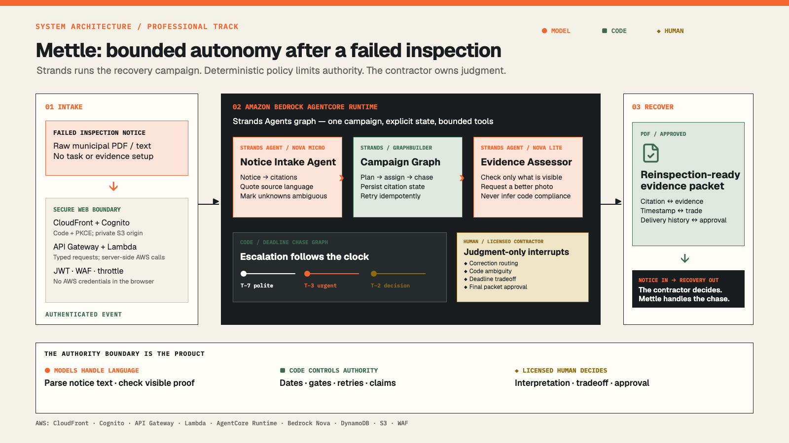

# Mettle


**From failed inspection to reinspection-ready.**

**Live guided demo:** https://d1ytth8asjpes8.cloudfront.net

Mettle turns a municipal failed-inspection notice into a deadline-driven recovery campaign for small residential contractors. It preserves the notice's language, organizes citation-specific work, follows the recovery clock, and asks the contractor only for decisions that require licensed judgment.

## Why Mettle is different

Mettle is not a chatbot wrapped around a punch list. An unstructured correction
notice starts the campaign, while code—not prompting—defines what the agent may
decide. Strands coordinates the work across time; deterministic policy owns
deadlines, idempotency, approval gates, and safety claims; the contractor owns
code interpretation, deadline tradeoffs, and final approval.



The diagram was designed in Pencil; its editable web export lives at
[`assets/architecture/mettle-architecture-pencil.html`](assets/architecture/mettle-architecture-pencil.html).

## The first working slice

The repository runs a complete notice-to-judgment slice locally and through the
official AgentCore development server, with an explicit opt-in for live Bedrock
intake. It can:

- load a realistic text-form correction notice from the command center;
- extract its citations without interpreting building code;
- stop before outreach so the contractor can confirm every assignee, closure route, and proof request;
- record citation-specific trade outreach through a safe local adapter;
- advance through server-selected T−7, T−3, T−2, T−1, and deadline checkpoints;
- replan only open citations, stop follow-ups when evidence is accepted, and increase urgency as the reinspection deadline approaches;
- pause at T−2 for the contractor's keep-date-or-reschedule judgment; and
- pause at ambiguous requirements, accept the contractor's decision, and resume with contractor-directed outreach;
- securely normalize a real JPEG/PNG photo, use Nova Lite to check only visible notice requirements, and accept, re-request, or reserve ambiguity for the contractor;
- retain synthetic fixtures as a deterministic, zero-cost demo fallback; and
- assemble an evidence packet, block download until final contractor approval, and produce a polished PDF with citation-to-evidence and communication-history traceability.

The product core now runs those steps as a real Strands graph. Deterministic
policy nodes parse and plan the campaign, a mandatory Strands review interrupt
keeps outreach at zero until the contractor approves the correction docket, and
an idempotent communication port records the resulting trade requests. A second Strands chase graph runs each scheduled
recovery check, including the T−2 deadline interrupt. No cloud model is invoked
in this local mode.

The command center exposes three execution choices under **Load notice**:
free local execution, local Strands with live Bedrock intake, and the deployed
AgentCore runtime. The public **guided demo** compresses the same recovery arc
into one autoplay control: accepted evidence, rejected evidence with a precise
re-request, deadline escalation, two meaningful human pauses, and a real,
contractor-approved four-page PDF. It is labeled as guided; it does not pretend
that browser playback is a production scheduler.

The deterministic core is intentional. Strands orchestrates the recovery graph, while Bedrock can replace only the intake node. Domain rules remain testable without a model.

## Run it locally

Use Python 3.12 and [`uv`](https://docs.astral.sh/uv/):

```bash
uv sync --extra dev
uv run mettle ingest examples/notices/failed-rough-in.txt --as-of 2026-08-10
uv run mettle serve
uv run pytest
```

Open [http://127.0.0.1:4310](http://127.0.0.1:4310) after starting the server. The demo binds only to the local machine.

Select **Run compressed recovery** for the reliable judge journey, or choose
**Load notice** to start a Strands workflow from the included representative
notice and synthetic roster. The notice mirrors the prose and numbered-comment
shape visible in public Douglas County inspection records; it deliberately
contains no `TRADE` or `EVIDENCE` fields. The local communication adapter
records every proposed message but never sends SMS. At T−2 Mettle asks whether
to keep the current date; once all evidence is accepted, the chase loop stands
down automatically. The packet remains unavailable until final approval.

Strands is installed as a core dependency, but no AWS credentials are needed
for the example or tests. Amazon Bedrock intake is deliberately opt-in, so
normal development and the dashboard never consume credits:

```bash
uv run mettle ingest examples/notices/failed-rough-in.txt \
  --provider bedrock \
  --aws-profile mettle-dev \
  --aws-region us-east-1 \
  --model-id amazon.nova-micro-v1:0 \
  --as-of 2026-08-10
```

To expose the separate, credit-metered **Run live Bedrock** action in the
dashboard, start the server explicitly with the least-privilege assumed-role
profile:

```bash
uv run mettle serve \
  --enable-bedrock \
  --aws-profile mettle-dev \
  --aws-region us-east-1
```

AWS profile, region, and the Nova Micro/Nova Lite allowlist remain server-side;
the browser cannot override them. The default **Start local · free** action
never calls Bedrock. Creation requests are idempotent, including across a
browser retry, so an identical retry does not make a second model call.

The Bedrock boundary uses a low-cost Nova Micro model, a 30,000-character
input ceiling, a 2,048-token output ceiling, short timeouts, and at most two
total attempts. The intake CLI refuses model IDs outside the approved Nova
Micro allowlist. Model output must validate as Mettle's bounded notice schema
before it can enter campaign state.

The same explicit Bedrock opt-in enables real-photo evidence assessment with
Nova Lite. Uploads are capped at 5 MB, decoded as JPEG/PNG, stripped of metadata,
bounded in pixel dimensions, and re-encoded before the model sees them. The
model must return one structured, pixel-grounded finding per notice requirement.
Mettle deterministically converts those findings to accepted, rejected, or
manual-review status; the model is never asked to certify code compliance.

## Run the AgentCore boundary locally

The official AgentCore app lives at `agentcore_app.py`. It accepts only bounded,
discriminated workflow operations—including `start`, `review`, `resume`, evidence,
packet, and `run_next_check`—preserves the Strands workflow in the
AgentCore session, and does not let callers select an AWS profile, region, or
model. Start the local runtime without deploying anything:

```bash
npx agentcore dev --runtime MettleRecovery --port 8081 --logs --skip-deploy
```

Package the direct-code artifact with:

```bash
npx agentcore validate --json
npx agentcore package --directory . --runtime MettleRecovery
scripts/prune_agentcore_zip.sh
```

The final command strips design sources, docs, tests, and build tooling from the
runtime zip, then fails if a forbidden path remains. The generated zip and
staging tree are ignored. The checked-in IAM policies
allow only Nova Micro and Nova Lite plus AgentCore telemetry and restrict deployment to
Project-tagged Mettle runtimes. See
[AgentCore deployment and rollback](docs/agentcore-deployment.md).

The cloud runtime currently deployed in `us-east-1` is `MettleRecovery` version 9.
Its tested path runs live Bedrock intake inside Strands, pauses before outreach
for a structured contractor review, resumes the same AgentCore session, assesses a normalized real photo
with Nova Lite, runs the T−3/T−2 chase loop with replay-safe follow-up and a
deadline judgment interrupt, gates packet approval, and returns a verified
five-page chased-campaign PDF. The immutable version 7 artifact remains
available as the latest known-good rollback target; artifact rollback and
restoration were already exercised on this runtime.

To expose **Run on AgentCore** in the command center, start the loopback-only
server with the deployed runtime fixed in server configuration:

```bash
uv run mettle serve \
  --enable-agentcore \
  --agentcore-runtime-arn arn:aws:bedrock-agentcore:us-east-1:123456789012:runtime/MettleRecovery-example \
  --aws-profile mettle-agentcore \
  --aws-region us-east-1
```

The browser can neither select a runtime nor access AWS credentials. The local
gateway owns the AgentCore session ID, reuses it for safe retries and resume,
caps process state, and sends only validated workflow operations. Cloud
workflow state can be restored while this local server remains running. The
server gateway verifies the returned PDF type and digest before offering the
contractor-approved download.

`mettle-dev` assumes the one-hour, least-privilege
`MettleHackathonDeveloper` role. It can invoke only the approved Nova models but cannot administer
IAM or invoke more expensive models. See [AWS access and teardown](docs/aws-access.md).

Workflow state is intentionally session-local when using the loopback server.
The public serverless boundary below stores user-scoped session mappings for
the AgentCore session's eight-hour lifetime; live communication remains a later
slice.

## Deploy the public dashboard securely

The public stack keeps the judge-facing deterministic demo open while requiring
an admin-created Cognito account for every credit-metered AgentCore route. It
uses a private S3/CloudFront frontend, HTTP API + Lambda, user-scoped DynamoDB
session records, a private one-day packet bucket, WAF, throttling, and an exact
AgentCore invocation grant. The browser never receives AWS credentials.

Build and deploy only after authenticating an infrastructure administrator:

```bash
scripts/deploy_web.sh mettle mettle-agentcore-artifacts-123456789012-us-east-1
```

The deploy script builds Linux Lambda dependencies in the official Lambda
Python container, packages CloudFormation into the existing private artifact
bucket, deploys the stack, fixes the Cognito PKCE callback to the resulting
CloudFront URL, uploads the static UI, and invalidates the edge cache. Cognito
self-registration is deliberately disabled; create only the demo-owner account
after deployment. See `infra/web/template.yaml` for the complete permission and
retention boundary.

## Product boundary

Mettle starts when an inspection has failed. It is not a permit-management suite, a punch-list replacement, or an authority on building code. It never claims that work is compliant, interprets an ambiguous citation autonomously, contacts an inspector without approval, or submits a final packet without the contractor's consent.

Read [the product scope](docs/product-scope.md) and [the architecture](docs/architecture.md) for the decisions behind the MVP.
